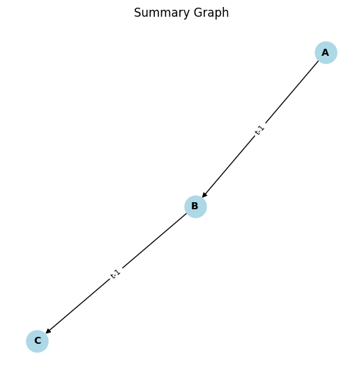

# AIOps LCM

This repository contains code and resources for testing Large Causal Models (LCMs). The aim is discovering temporal causal relationships in time-series datasets, using pretrained deep NN models. The LCM takes as input a temporal dataset $X \in \mathbb{R}^{N \times D}$ where $N$ is the sample size and $D$ the feature size (number of time-series). The output is a lagged adjacency tensor of shape $(N, N, \ell_\text{max})$ where $\ell_\text{max}$ is the hyperparemeter of the maximum assumed lag.


## Installation

Install the dependencies from the `requirements.txt` file, either on your base environment or into an existing conda environment using

`pip install -r requirements.txt`

## Pre-trained weights

Obtain the LCM weights from the following URLs and place them into the `res` folder:

- `deep_CI_12_3_fine_tuned_frozen_sim_82k_pre_joint_220k` (210 MB): [download link](https://onebox.huawei.com/p/8cc0be09bfd68373ba262382f6c2d9dd)
- `lcm_CI_RH_12_3_merged_290k` (4.6 GB): [download link](https://onebox.huawei.com/p/7cfe822b2fa5594b04d62403e5f90a38)

---

## Illustrative Example


### 1. Import Required Libraries

At first, import the necessary modules for data generation, model prediction, and result visualization:


```python
from pathlib import Path
from utils.model_wrapper import Architecture_PL
from utils.cp_utils import set_seed, create_example_data, run_cp_and_parse_res
from utils.plotting_utils import plot_summary_from_pred
```

### 2. Generate Synthetic Data

We generate synthetic data with 1000 time samples, where each column represents a different time series. Data are Min-max normalized and random seed set to `42` for reproducibility.

```python
set_seed(42)

df = create_example_data(n=1000)
variable_names = list(df.columns)
```

### 3. Load the Pretrained Model

Load the `.ckpt` pretrained model for causal prediction:

```python
models_path = 'res'
model_name = 'lcm_CI_RH_12_3_merged_290k'

model = Architecture_PL.load_from_checkpoint(Path(models_path) / f"{model_name}.ckpt")
```

### 4. Perform Causal Discovery

Run `run_cp_and_parse_res` to perform causal discovery on the previous data. The `max_lag` parameter specifies the maximum time window size for analyzing causal relationships:

```python
# Run causal discovery with a maximum lag of 2
pred = run_cp_and_parse_res(model_name, model=model, df=df, max_lag=2, seed=42)
```

The result is a lagged adjacency tensor of shape `(N, N, max_lag)` where:

- `N` is the number of input time-series
- `pred[i, j, k]` represents the probability that the `j`-th time-series at time `t-k` causes the `i`-th time-series at time `t`.

### 5. Visualize the Results

The predicted causal relationships can be visualized using `plot_summary_from_pred`. The `plt_thr` parameter controls the density of the graph: higher values result in fewer edges being displayed.

```python
plot_summary_from_pred(pred, variable_names, plt_thr=0.5)
```

In the resulting graph, an edge from time series A to B marked as `t-1` means that time series A at time `t-1` caused time series B at time `t`.




The above example can be found in `simple_example.py`

---

### Limitations

We assume Causal Markov Condition and Faithfulness throughout. The following assumptions are also made:

- **Causal inference of up to 12 variables and 3 time lags**: The models can handle inputs up to 12 variables and $\ell_\text{max}=1,2,3$.

- **No contemporaneous effects**: All cause-effect pairs are assumed to occur with lag $\ell > 0$.

- **No unobserved confounders**: The model assumes that there are no latent confounders (unobserved common causes) that could influence the relationships between the variables.

- **Causal Stationarity**: The graph structure and noise distribution of the SCM does not change over time.

- **Time-series stationarity**: The input time-series are assumed to be stationary.